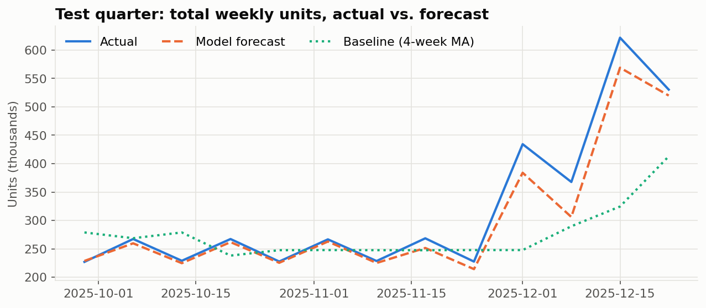
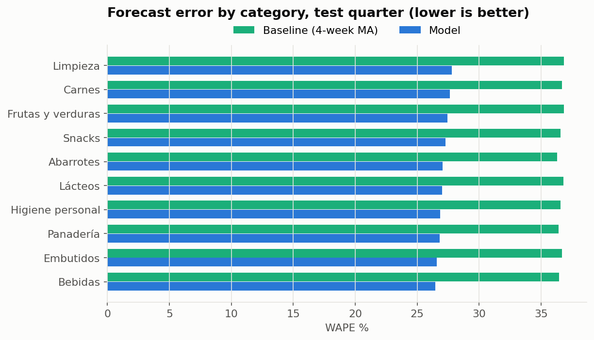

# Weekly Demand Forecasting for a Retail Distributor

**26 % less forecast error than the planner's current rule, measured on a quarter the model never saw.**

Capstone project for the *Integrative Project in Artificial Intelligence* course (SINT-649) at Universidad CENFOTEC, Costa Rica, 2026. Team of five students.



## The problem

*Distribuidora Valle Central S.A.* (a course case study) supplies **12 stores** in Costa Rica's Central Valley with **340 products**. Every Monday a planner decides how many units of each product to send to each store, using a simple rule: the average of the last 4 weeks of sales.

That rule ignores seasonality, paydays (*quincenas*), holidays and promotions. The company writes off **6 % of inventory as waste (≈ ₡108 M per year)**, mostly perishables.

**Goal (set before modeling):** reduce MAE by **at least 20 %** versus the 4-week rule, at product × store × week level, on a held-out test period.

## Results (test quarter: Oct–Dec 2025, 53,040 forecasts)

| Metric | 4-week rule (baseline) | Model | Improvement |
|---|---:|---:|---:|
| **MAE** (units) | 28.71 | **21.25** | **26.0 %** |
| RMSE (units) | 50.14 | 35.93 | 28.3 % |
| WAPE | 36.6 % | 27.1 % | 26.0 % |
| MAPE (non-zero weeks) | 38.6 % | 31.7 % | 18.0 % |

- ✅ **Acceptance criterion met** (≥ 20 % MAE reduction).
- ✅ **Fairness check passed:** urban vs. rural WAPE gap of **1.4 pp** (threshold: 10 pp, defined before seeing results).
- The model beats the baseline in **all 10 product categories** by about 9–10 WAPE points.
- **December** is where the old rule fails worst: it lags the peak badly. The model tracks it much better but still runs about **9 % short**, so the recommendation is a manual safety margin on non-perishables.



## Approach

```
raw weekly sales ─► audit & cleaning ─► lag / rolling features ─► temporal split ─► model selection ─► tuning (time-series CV) ─► one-shot test evaluation
```

**1. Data audit** ([`01_data_audit.ipynb`](notebooks/01_data_audit.ipynb)), 560,685 rows, 2023-2025
- **Found and removed two leaking columns.** `stock_final` equals `stock_inicial − unidades` in 99.97 % of rows. `stock_inicial` (0.98 correlation with the target) is the planner's own decision, so using it would teach the model to copy the planner.
- **`promocion` was never recorded in 2023.** Instead of treating that as "no promotion", added an explicit *no-record* flag.
- Documented censored demand: sold-out weeks record sales, not true demand.
- Detected two stores opened in 2025, both rural, so results are also reported by store age.

**2. Features and model selection** ([`02_features_and_model_selection.ipynb`](notebooks/02_features_and_model_selection.ipynb))
- Lags (1, 2, 4 weeks), 4- and 8-week moving averages, 4-week volatility, trend, calendar flags, product and store attributes.
- Every rolling feature uses `shift(1)` first, so a week never sees its own sales (verified with asserts).
- **Strict temporal split:** train through Jun 2025 → validation Jul–Sep 2025 → test Oct–Dec 2025. Never random.
- Redundant features chosen **empirically**: 4-week vs. 8-week vs. both moving averages, compared on validation. The 8-week window wins by ≈1.3 units of MAE.
- Compared against the baseline and linear regression. Gradient boosting was the only model to clear the 20 % bar on validation.

**3. Tuning and final evaluation** ([`03_tuning_and_final_evaluation.ipynb`](notebooks/03_tuning_and_final_evaluation.ipynb))
- `GridSearchCV` with `TimeSeriesSplit`, 12 core configurations plus 6 regularization settings, all on the same chronological sample so they're comparable.
- Overfitting check on the finalists (train vs. validation MAE).
- The test quarter was used **once**, after every decision was locked.
- Error breakdown by store type, store age, category and December vs. the rest of the quarter.

**Final model:** scikit-learn `GradientBoostingRegressor` (100 trees, depth 3, learning rate 0.1) inside a `Pipeline` with `ColumnTransformer` (one-hot + scaling).

## Responsible AI

The ethics and AI-justification work was framed at the start of the project, not added at the end:

- **Why ML at all:** four options were compared: better business rules, ARIMA/ETS, gradient boosting and commercial forecasting software. Separate ARIMA/ETS models don't scale to 4,080 product-store series and can't capture interactions like promotion × category. Better rules would need constant manual tuning. A single global gradient-boosting model can learn shared patterns and be retrained as data grows.
- **Human in the loop:** the model is decision *support*. The planner reviews every order, which limits the impact of errors. Over-forecasting means waste on perishables; under-forecasting means stock-outs.
- **Geographic bias:** store location could act as a proxy that systematically under-supplies some areas. That's why an urban/rural fairness threshold was committed to in stage 1 and checked on both validation and test.
- **Data protection:** the data is aggregated at product-store-week level, with no personal data. Costa Rica's Personal Data Protection Law (Ley 8968) therefore does not apply directly, but the purpose-limitation principle was respected.
- **Honest reporting:** results are reported on data the model never saw, against the real current process, with limitations stated.

## My role

- **Project coordinator:** split the work into stages and assigned tasks across the five-person team, and kept each stage consistent with the goals set in stage 1.
- **Owned the ethics, responsibility and AI-justification sections:** the alternatives analysis, risk assessment, fairness criteria and legal review summarized above.
- Consolidated the team's course notebooks into this repository.

## Repository structure

```
├── notebooks/
│   ├── 01_data_audit.ipynb
│   ├── 02_features_and_model_selection.ipynb
│   └── 03_tuning_and_final_evaluation.ipynb
├── src/
│   ├── data_prep.py        # cleaning, features, temporal split, metrics (shared by all notebooks)
│   └── plot_style.py
├── data/
│   ├── sample/             # 30 products × 12 stores × 156 weeks (≈49k rows)
│   ├── raw/                # full dataset goes here (not published)
│   └── data_dictionary_es.csv
├── images/                 # charts exported by the notebooks
├── scripts/                # sample generation, notebook builder
└── requirements.txt
```

## How to run

```bash
pip install -r requirements.txt
cd notebooks
jupyter notebook
```

The notebooks detect the data automatically. If `data/raw/valle_central_ventas_semanales.csv` is present they use the full dataset; otherwise they run on the published sample (3 products per category, all stores, all weeks). **All results in this README come from the full dataset**, and numbers on the sample will differ. Notebook 03 takes about 20 minutes on a laptop CPU because of the grid search.

## Notes on this version

This repository cleans up and consolidates the notebooks from the course, which were written stage by stage in class. Two things changed along the way:

- The course's stage-3 notebook switched from the 8-week to the 4-week moving average. Testing both on validation showed the 8-week version is clearly better, which is why the improvement over the baseline rises from 22.4 % (course submission) to **26.0 %**.
- In the course version, hyperparameter searches used different data samples, so their results weren't comparable. Here every search runs on the same sample and the same folds.

---
*Data: case-study dataset provided by Universidad CENFOTEC for SINT-649. Column names are kept in Spanish, as in the original dataset; see [`data/data_dictionary_es.csv`](data/data_dictionary_es.csv).*
